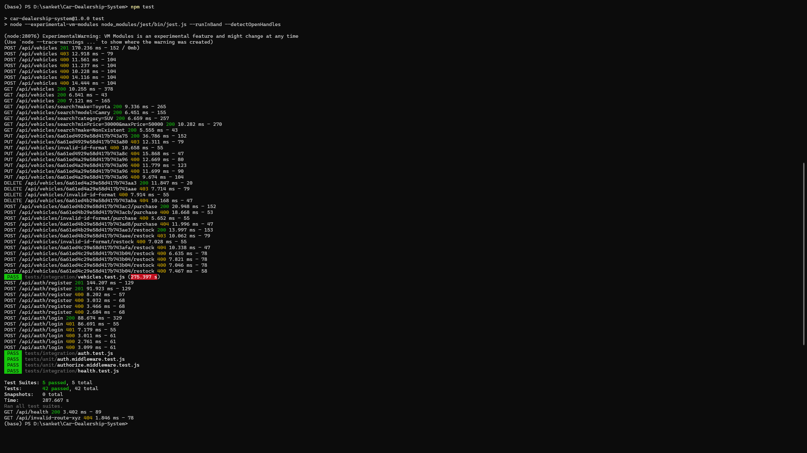
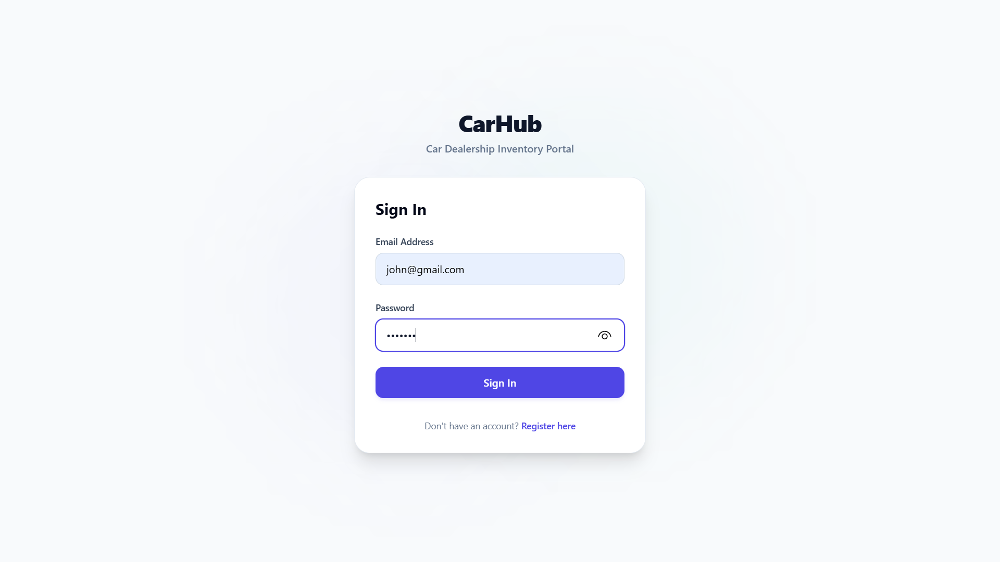
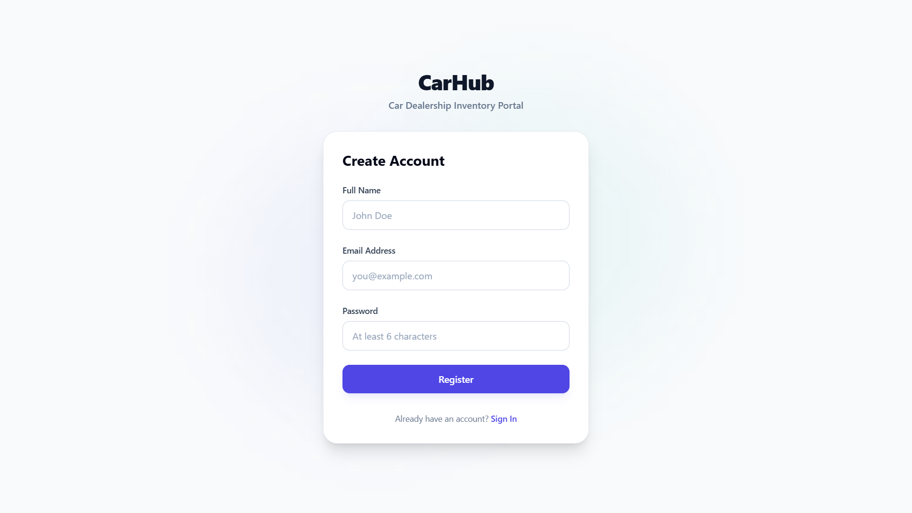
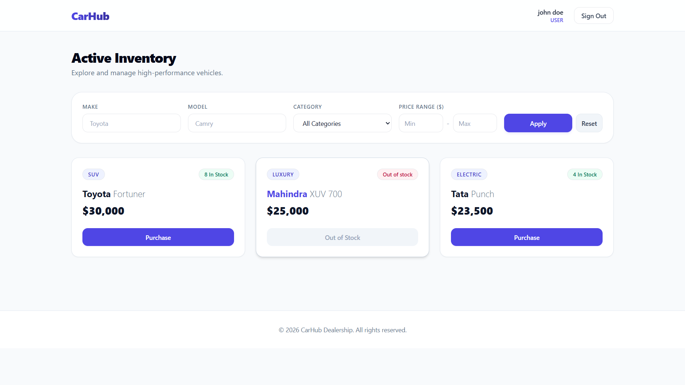
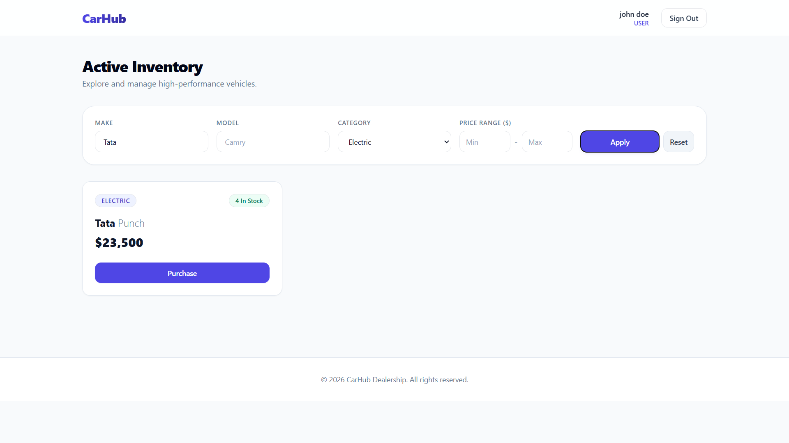
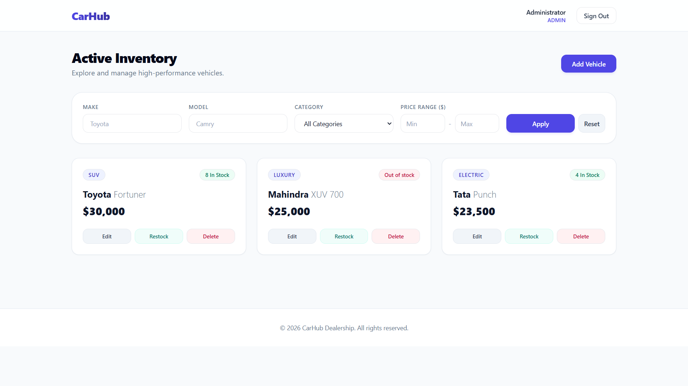
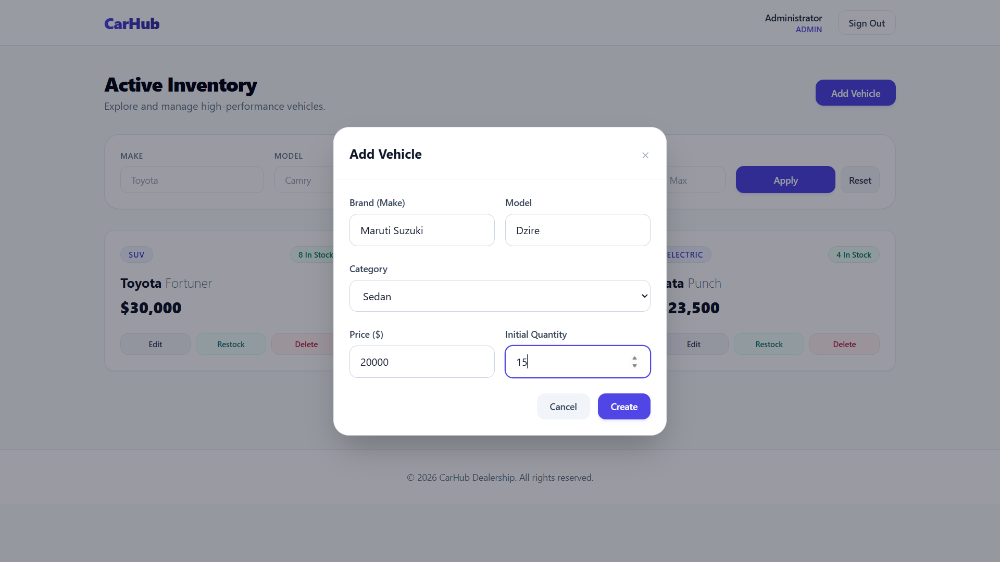
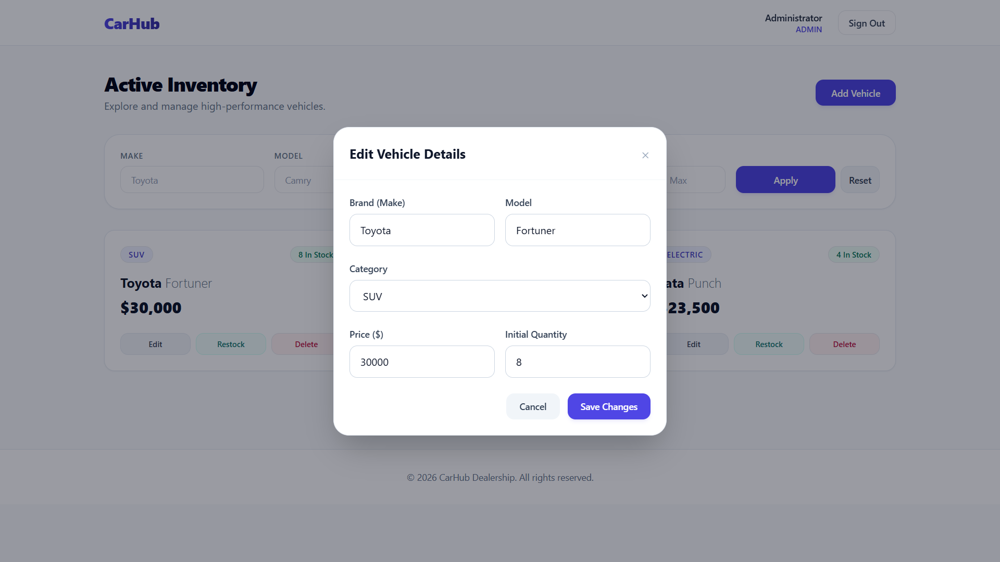
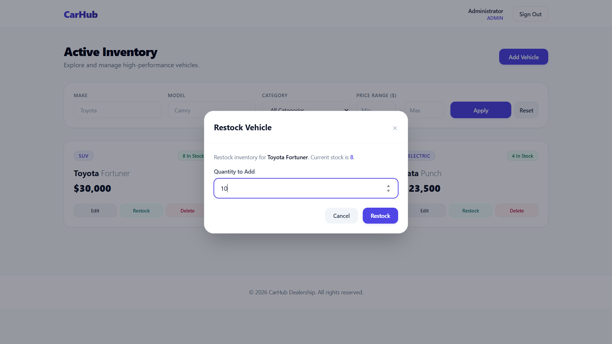

# 🚗 CarHub - Car Dealership Inventory System

A full-stack **Car Dealership Inventory System** built using the **MERN Stack** following **Test-Driven Development (TDD)** principles. The application allows users to browse, search, and purchase vehicles while providing administrators with a secure dashboard to manage dealership inventory efficiently.

---

# 📖 Project Overview

CarHub is a modern inventory management application designed for car dealerships. It provides a seamless experience for customers to explore available vehicles and enables administrators to manage inventory through a dedicated admin panel.

## 👤 User Features

- User Registration
- Secure Login using JWT Authentication
- Browse Available Vehicles
- Search Vehicles
- Filter Vehicles
- Purchase Vehicles
- Real-time Inventory Updates

## 👨‍💼 Admin Features

- Add New Vehicles
- Update Vehicle Details
- Delete Vehicles
- Restock Vehicle Inventory
- Manage Complete Vehicle Inventory

---

# 🛠 Tech Stack

## Backend

- Node.js
- Express.js
- MongoDB
- Mongoose
- JWT Authentication
- bcrypt
- Jest
- Supertest

## Frontend

- React (Vite)
- Tailwind CSS
- Axios
- React Router DOM

---

# 📂 Project Structure

```text
Car-Dealership-System/

├── backend/
│   └── src/
│       ├── config/
│       ├── controllers/
│       ├── middleware/
│       ├── models/
│       ├── routes/
│       ├── services/
│       ├── tests/
│       ├── validators/
│       ├── utils/
│       ├── app.js
│       └── server.js
│
├── frontend/
│   └── src/
│       ├── api/
│       ├── components/
│       ├── context/
│       ├── hooks/
│       ├── pages/
│       ├── routes/
│       └── main.jsx
│
├── screenshots/
│   ├── login.png
│   ├── register.png
│   ├── user-dashboard.png
│   ├── admin-dashboard.png
│   ├── search-vehicle.png
│   ├── add-vehicle.png
│   ├── update-vehicle.png
│   ├── restock-vehicle.png
│   └── test-report.png
│
├── README.md
└── PROMPTS.md
```

---

# 🚀 API Endpoints

## Authentication

| Method | Endpoint |
|---------|----------|
| POST | `/api/auth/register` |
| POST | `/api/auth/login` |

---

## Vehicle Management

| Method | Endpoint |
|---------|----------|
| POST | `/api/vehicles` |
| GET | `/api/vehicles` |
| GET | `/api/vehicles/search` |
| PUT | `/api/vehicles/:id` |
| DELETE | `/api/vehicles/:id` |

---

## Inventory Management

| Method | Endpoint |
|---------|----------|
| POST | `/api/vehicles/:id/purchase` |
| POST | `/api/vehicles/:id/restock` |

---

# ⚙️ Local Setup

## Clone Repository

```bash
git clone https://github.com/Sanket-Patoliya/Car-Dealership-System.git
```

---

## Backend Setup

```bash
cd backend

npm install
```

Create a `.env` file:

```env
PORT=5000

MONGODB_URI=your_mongodb_connection_string

JWT_SECRET=your_secret_key
```

Run the backend server:

```bash
npm run dev
```

---

## Frontend Setup

```bash
cd frontend

npm install

npm run dev
```

---

# 🧪 Running Tests

Run all backend tests:

```bash
npm test
```

The backend test suite covers:

- Authentication
- Authorization
- Vehicle CRUD Operations
- Vehicle Search
- Purchase Functionality
- Restock Functionality

---

# ✅ Test Report

The backend was developed following the **Red → Green → Refactor** cycle of **Test-Driven Development (TDD)**.

Testing Tools:

- Jest
- Supertest

### Test Results



---

# 📸 Application Screenshots

## Login Page



---

## Register Page



---

## User Dashboard



---

## Search Vehicles



---

## Admin Dashboard



---

## Add Vehicle



---

## Update Vehicle



---

## Restock Vehicle



---

# 🔐 Admin Access

Every newly registered user is assigned the following role by default:

```text
user
```

To access the Admin Dashboard during development:

1. Register a new account.
2. Open MongoDB Compass.
3. Change the user's role to:

```json
{
  "role": "admin"
}
```

4. Log in again to receive a JWT token containing the updated role.

---

# 🤖 My AI Usage

AI assistance was used throughout the development process to improve productivity while ensuring that every implementation was manually reviewed and verified.

## AI Tool Used

- Antigravity

## How AI Was Used

AI was used to assist with:

- Initial project setup
- Backend folder structure
- Express.js configuration
- MongoDB connection setup
- REST API design
- Authentication implementation
- JWT middleware generation
- Vehicle CRUD implementation
- Search and filtering logic
- Purchase and restock functionality
- Jest & Supertest test generation
- React component scaffolding
- Debugging support
- Refactoring suggestions
- Documentation generation

## Development Process

Every AI-generated response was:

- Reviewed manually
- Modified where required
- Tested before committing
- Verified against project requirements

The complete AI prompt history used during development is available in:

```text
PROMPTS.md
```

---

# 📌 Git Workflow

The project was developed using **small, frequent commits** while following the **Red → Green → Refactor** workflow.

Example:

```text
test: add registration tests

feat: implement user registration

refactor: extract auth service

test: add vehicle creation tests

feat: implement vehicle creation

refactor: improve vehicle service
```

AI-assisted commits include a co-author trailer to maintain transparency as required by the project guidelines.

---

# 👨‍💻 Author

**Sanket Patoliya**
