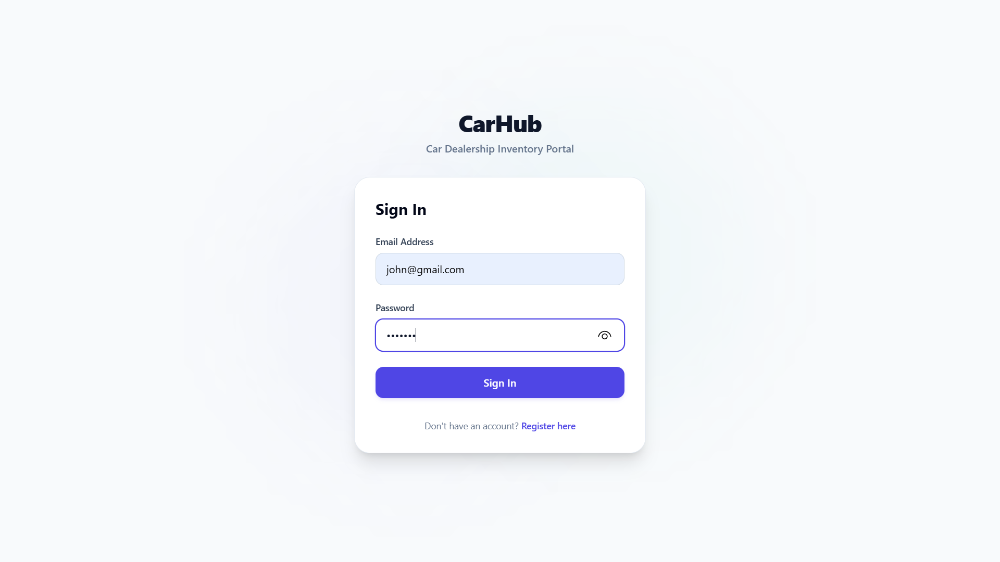
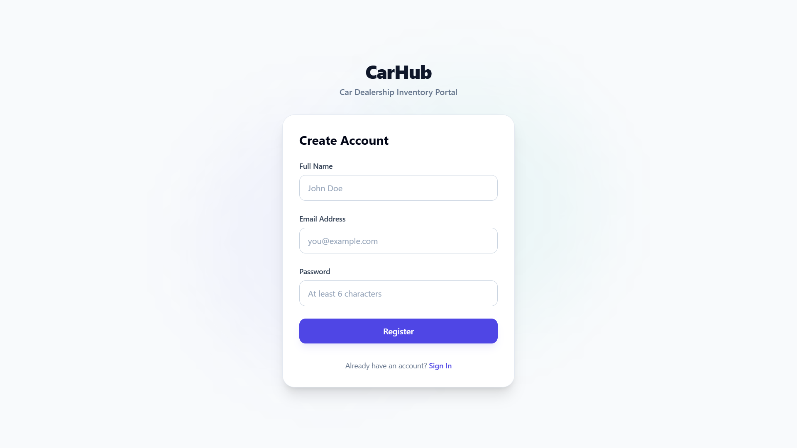
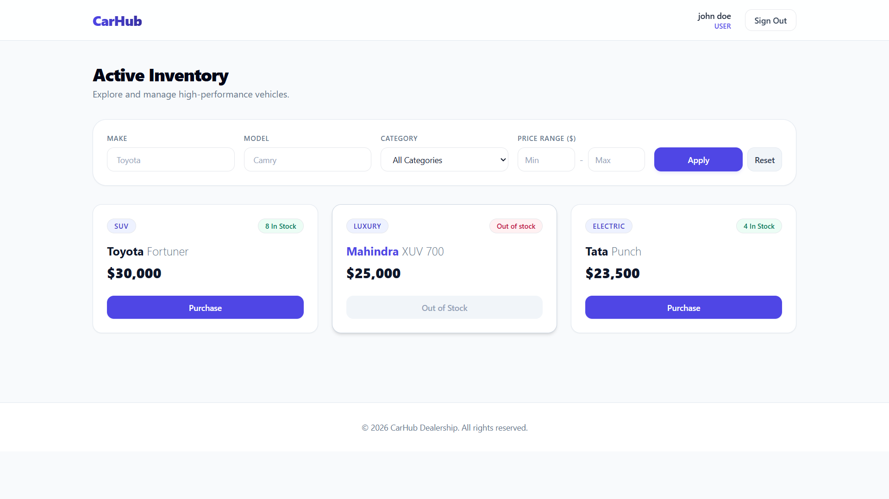
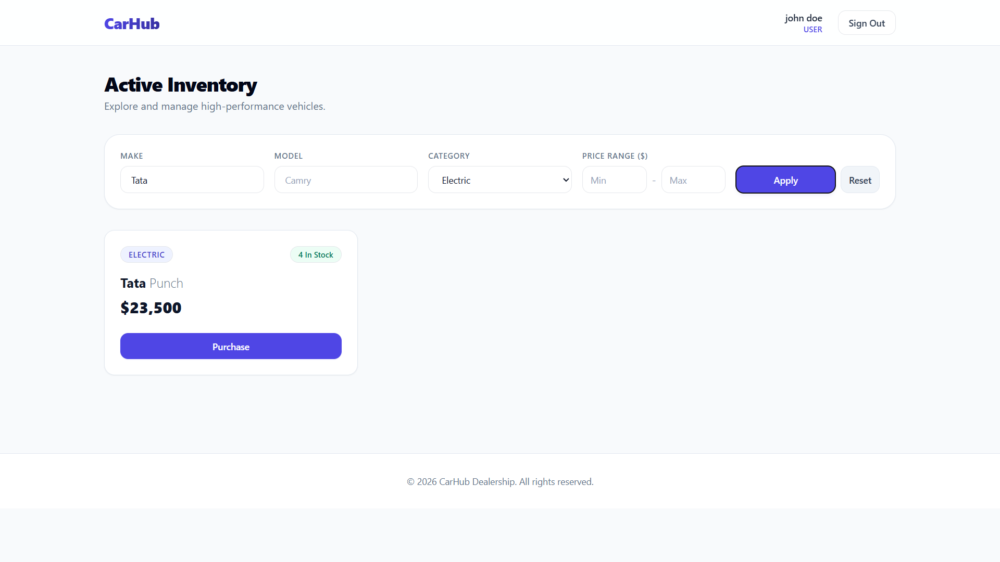
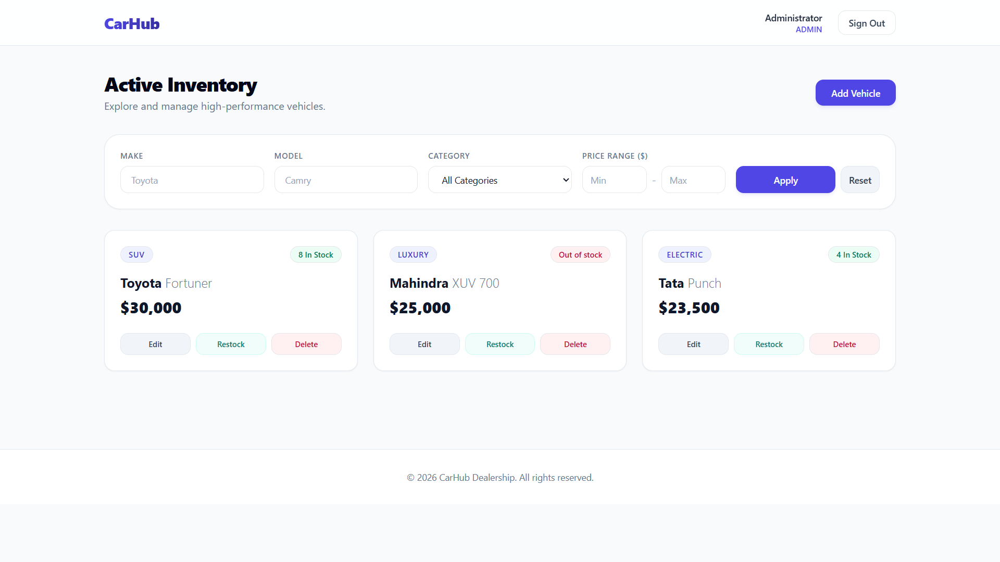
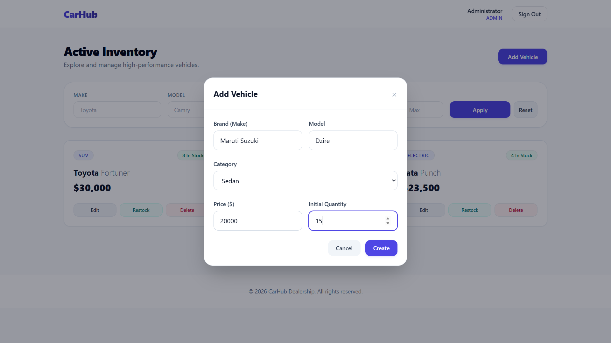
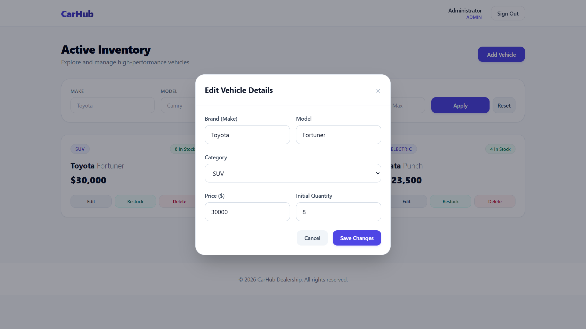
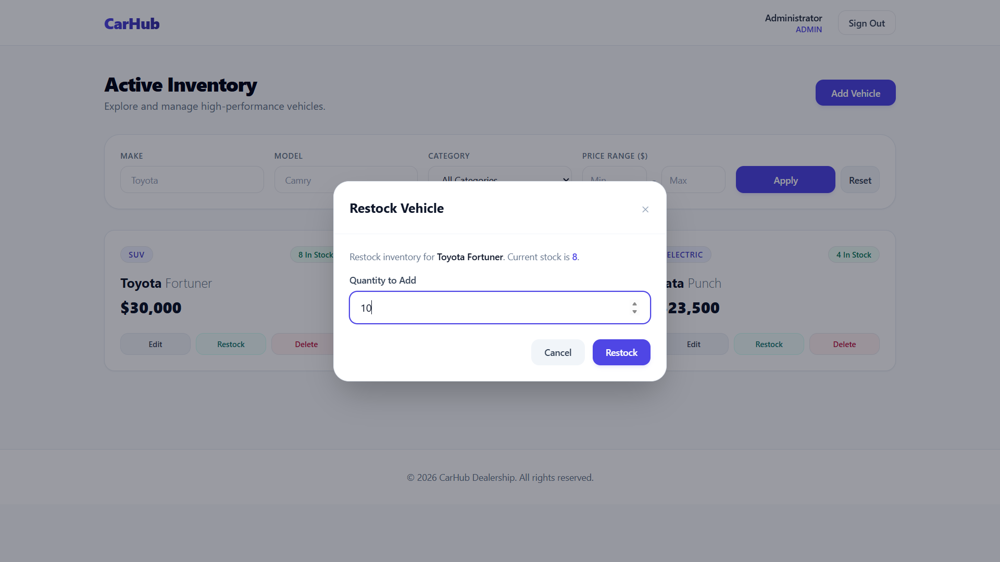

# 🚗 CarHub - Car Dealership Inventory System

A full-stack **Car Dealership Inventory System** built using the **MERN Stack** following **Test-Driven Development (TDD)** and **Clean Layered Architecture** principles. The project is organized into separate **`backend/`** and **`frontend/`** applications.

---

# 📖 Project Overview

CarHub is a modern inventory management application designed for car dealerships. It provides a seamless experience for customers to explore available vehicles and enables administrators to manage inventory through a dedicated admin panel.

## 👤 User Features

- User Registration with express-validator sanitization
- Secure Login using JWT Authentication & bcrypt hashing
- Browse Available Vehicles
- Search Vehicles by make, model, category, and price range
- Purchase Confirmation Page (`/purchase/:vehicleId`) with complete vehicle specifications and explicit user confirmation
- Real-time Inventory Updates

## 👨‍💼 Admin Features

- Add New Vehicles with input validation
- Update Vehicle Details
- Delete Vehicles
- Restock Vehicle Inventory with atomic increments
- Manage Complete Vehicle Inventory

---

# 📂 Project Structure

```text
CarHub/
├── backend/
│   ├── src/
│   │   ├── config/
│   │   ├── constants/
│   │   ├── controllers/
│   │   ├── middleware/
│   │   ├── models/
│   │   ├── routes/
│   │   ├── services/
│   │   ├── utils/
│   │   ├── validators/
│   │   ├── app.js
│   │   └── server.js
│   ├── tests/
│   │   ├── unit/
│   │   ├── integration/
│   │   └── setup.js
│   ├── .env.example
│   ├── jest.config.js
│   ├── package.json
│   └── package-lock.json
│
├── frontend/
│   ├── src/
│   │   ├── api/
│   │   ├── components/
│   │   ├── context/
│   │   ├── pages/
│   │   │   ├── Dashboard.jsx
│   │   │   ├── Login.jsx
│   │   │   ├── Register.jsx
│   │   │   └── PurchaseConfirmation.jsx
│   │   ├── routes/
│   │   ├── App.jsx
│   │   └── main.jsx
│   ├── public/
│   ├── package.json
│   ├── vite.config.js
│   └── index.html
│
├── screenshots/
├── README.md
└── PROMPTS.md
```

---

# ⚙️ Quick Start & Local Setup

## 1. Backend Setup

```bash
cd backend

# Install dependencies
npm install

# Configure environment variables
# Create a .env file (refer to .env.example)
```

Run backend server:

```bash
# Development mode
npm run dev

# Run backend tests
npm test
```

## 2. Frontend Setup

```bash
cd frontend

# Install dependencies
npm install

# Start Vite dev server
npm run dev
```

---

# 🚀 API Endpoints

## Base Health Check

| Method | Endpoint | Description | Auth Required |
|--------|----------|-------------|---------------|
| GET | `/api/health` | Health check endpoint | No |

## Authentication

| Method | Endpoint | Description | Auth Required |
|--------|----------|-------------|---------------|
| POST | `/api/auth/register` | Register a new user | No |
| POST | `/api/auth/login` | Login user & get JWT | No |

## Vehicle Management

| Method | Endpoint | Description | Auth Required |
|--------|----------|-------------|---------------|
| GET | `/api/vehicles` | List all vehicles | No |
| GET | `/api/vehicles/search` | Search vehicles with filters | No |
| POST | `/api/vehicles` | Create a new vehicle | Yes (Admin) |
| PUT | `/api/vehicles/:id` | Update an existing vehicle | Yes (Admin) |
| DELETE | `/api/vehicles/:id` | Delete a vehicle | Yes (Admin) |

## Inventory Management

| Method | Endpoint | Description | Auth Required |
|--------|----------|-------------|---------------|
| POST | `/api/vehicles/:id/purchase` | Purchase a vehicle (-1 stock) | Yes (User/Admin) |
| POST | `/api/vehicles/:id/restock` | Restock vehicle inventory | Yes (Admin) |

---

# 📸 Application Screenshots

## Login Page



---

## Register Page



---

## User Dashboard



---

## Search Vehicles



---

## Admin Dashboard



---

## Add Vehicle



---

## Update Vehicle



---

## Restock Vehicle



---

# 🔐 Admin Access

Every newly registered user is assigned the default role `USER`.

Default Admin account seeded automatically on startup if connected to MongoDB:
- **Email**: `admin@gmail.com`
- **Password**: `admin123`

---

# 🤖 AI Usage & Transparency

AI assistance was used throughout development to maintain high quality and adherence to best practices.

The complete AI prompt history is preserved in [PROMPTS.md](file:///c:/Users/visaveliya%20yagnik/Desktop/Sanket/Car-Dealership-System/PROMPTS.md).

---

# 👨‍💻 Author

**Sanket Patoliya**
